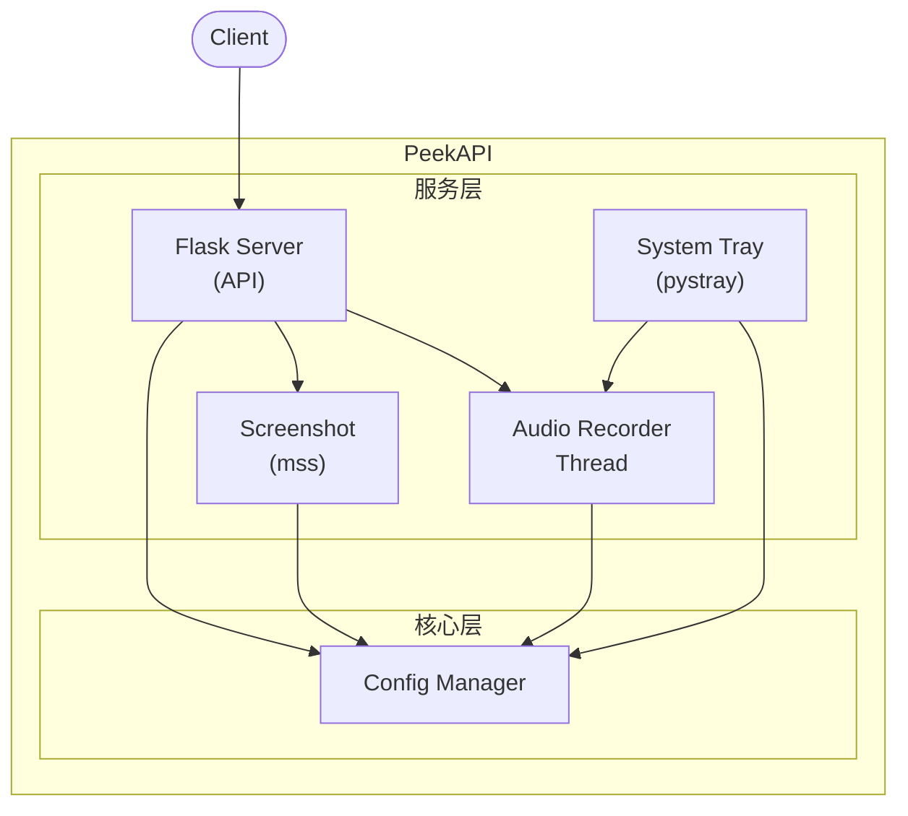
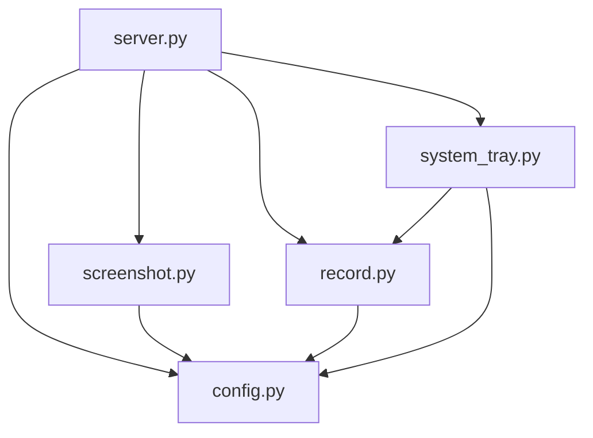
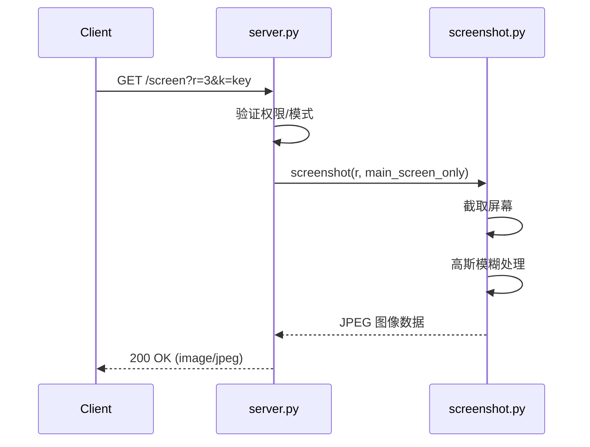
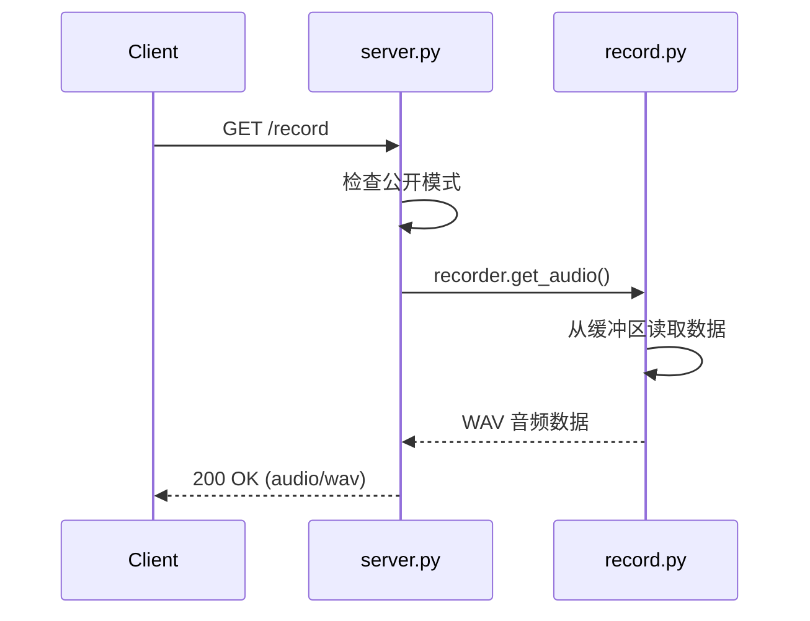

# System Patterns - PeekAPI

## 目录

- [System Patterns - PeekAPI](#system-patterns---peekapi)
  - [目录](#目录)
  - [系统架构](#系统架构)
  - [模块职责](#模块职责)
    - [server.py - HTTP 服务](#serverpy---http-服务)
    - [config.py - 配置管理](#configpy---配置管理)
    - [screenshot.py - 截图服务](#screenshotpy---截图服务)
    - [record.py - 音频录制](#recordpy---音频录制)
    - [system\_tray.py - 系统托盘](#system_traypy---系统托盘)
  - [关键设计模式](#关键设计模式)
    - [1. 单例配置](#1-单例配置)
    - [2. 环形缓冲区](#2-环形缓冲区)
    - [3. 后台线程录制](#3-后台线程录制)
    - [4. 设备重连机制](#4-设备重连机制)
  - [组件关系](#组件关系)
  - [数据流](#数据流)
    - [截图请求](#截图请求)
    - [录音请求](#录音请求)
  - [技术决策记录](#技术决策记录)

---

## 系统架构



## 模块职责

### server.py - HTTP 服务
- 提供 Flask HTTP API
- 路由处理：`/screen`、`/record`、`/check`
- 日志系统配置
- 应用入口点

### config.py - 配置管理
- 加载和解析 `config.toml`
- 使用 Pydantic 进行配置验证
- 提供便捷的属性访问器
- 运行时状态管理（如 `is_public`）

### screenshot.py - 截图服务
- 使用 mss 库进行屏幕截取
- 支持多显示器和主显示器模式
- 高斯模糊处理
- 返回 JPEG 格式图像数据

### record.py - 音频录制
- 使用 soundcard 库录制系统 Loopback 音频
- 环形缓冲区存储最近录音
- 后台线程持续录制
- 支持设备断开自动重连
- 音量增益处理

### system_tray.py - 系统托盘
- 使用 pystray 创建托盘图标
- 模式切换菜单
- 重启录音功能
- Windows 通知（winotify）

## 关键设计模式

### 1. 单例配置
```python
config = Config.load()  # 全局配置实例
```

### 2. 环形缓冲区
```python
self.buffer: collections.deque[np.int16] = collections.deque(maxlen=self.buffer_size)
```
- 固定大小的缓冲区存储最近 N 秒音频
- 自动丢弃旧数据

### 3. 后台线程录制
```python
self.record_thread = threading.Thread(target=self._record_main_loop, daemon=True)
```
- Daemon 线程，主程序退出时自动结束
- 持续写入音频数据到缓冲区

### 4. 设备重连机制
```python
while self.is_recording:
    mic = self._get_loopback_mic()
    if mic is None:
        consecutive_errors += 1
        time.sleep(RECONNECT_DELAY_SECONDS)
        continue
```

## 组件关系



## 数据流

### 截图请求



### 录音请求



## 技术决策记录

| 决策 | 原因 |
|------|------|
| 使用 Flask | 轻量级，易于部署，足够满足需求 |
| 使用 mss | 跨平台截图库，性能好 |
| 使用 soundcard | 支持 Loopback 录音 |
| 使用 pystray | 跨平台系统托盘支持 |
| 使用 Pydantic | 配置验证和类型安全 |
| 环形缓冲区 | 固定内存占用，自动管理旧数据 |
