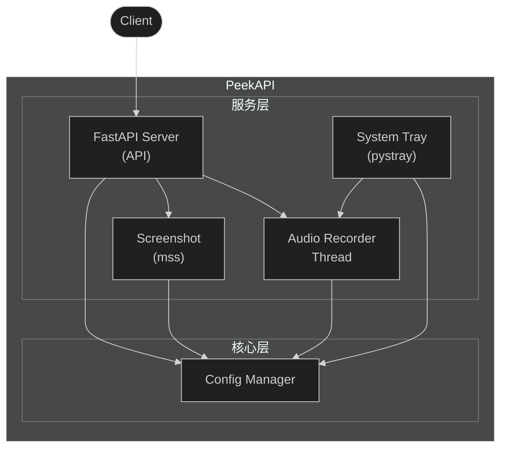
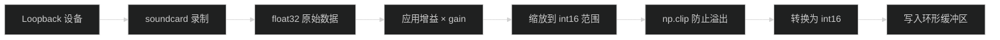
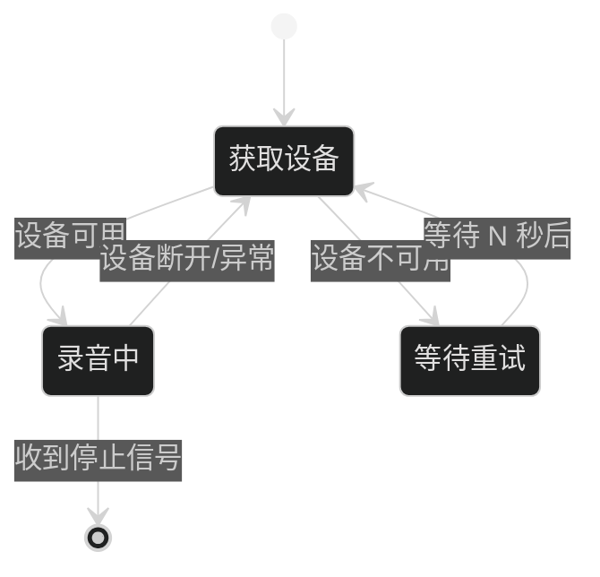
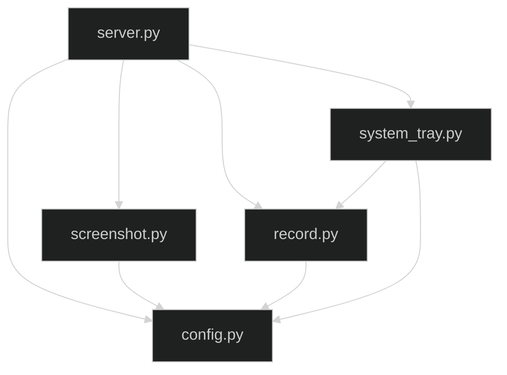
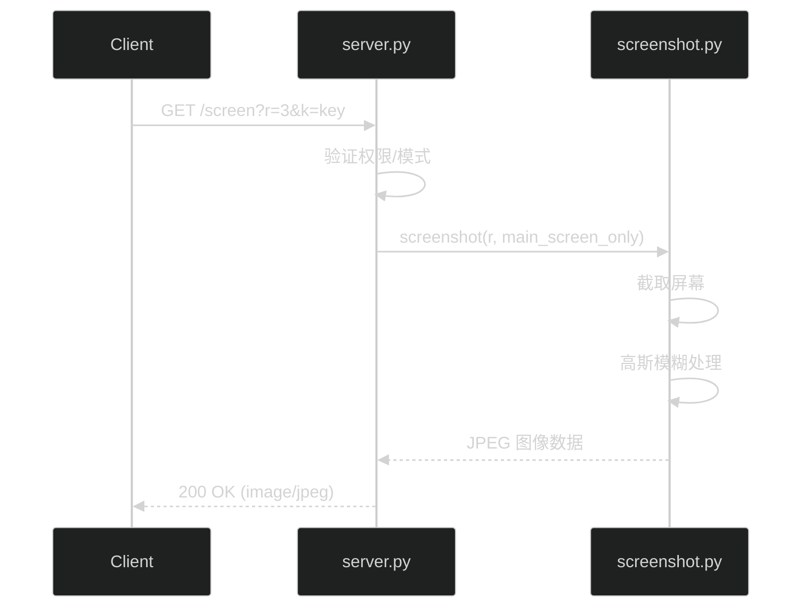
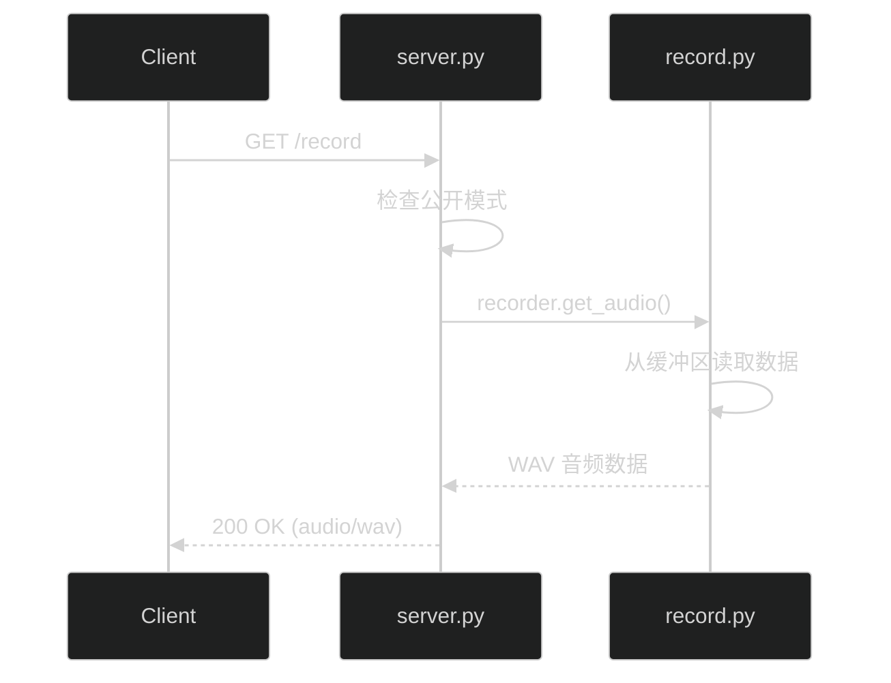

# System Patterns - PeekAPI

## 目录

- [System Patterns - PeekAPI](#system-patterns---peekapi)
  - [目录](#目录)
  - [系统架构](#系统架构)
  - [模块职责](#模块职责)
    - [server.py - HTTP 服务](#serverpy---http-服务)
    - [config.py - 配置管理](#configpy---配置管理)
    - [screenshot.py - 截图服务](#screenshotpy---截图服务)
    - [record.py - 音频录制](#recordpy---音频录制)
      - [AudioRecorder 类结构](#audiorecorder-类结构)
      - [核心方法](#核心方法)
      - [音频数据处理流程](#音频数据处理流程)
      - [设备重连机制](#设备重连机制)
      - [环形缓冲区机制](#环形缓冲区机制)
      - [get\_audio() 输出格式](#get_audio-输出格式)
      - [全局实例](#全局实例)
    - [system\_tray.py - 系统托盘](#system_traypy---系统托盘)
  - [关键设计模式](#关键设计模式)
    - [1. 单例配置](#1-单例配置)
    - [2. 环形缓冲区](#2-环形缓冲区)
    - [3. 后台线程录制](#3-后台线程录制)
    - [4. 设备重连机制](#4-设备重连机制)
  - [组件关系](#组件关系)
  - [数据流](#数据流)
    - [截图请求](#截图请求)
    - [录音请求](#录音请求)
  - [内存占用分析](#内存占用分析)
    - [总体内存占用](#总体内存占用)
    - [音频录制内存详细分析](#音频录制内存详细分析)
      - [环形缓冲区占用](#环形缓冲区占用)
      - [录音线程临时内存](#录音线程临时内存)
      - [get\_audio() 临时内存](#get_audio-临时内存)
      - [内存占用公式](#内存占用公式)
    - [截图临时内存](#截图临时内存)
    - [内存优化策略](#内存优化策略)
  - [技术决策记录](#技术决策记录)

---

## 系统架构



## 模块职责

### server.py - HTTP 服务
- 提供 FastAPI HTTP API（Uvicorn 作为 ASGI 服务器）
- 路由处理：`/screen`、`/record`、`/check`
- 日志系统配置
- 应用入口点

### config.py - 配置管理
- 加载和解析 `config.toml`
- 使用 msgspec Struct 进行配置验证
- 提供便捷的属性访问器
- 运行时状态管理（如 `is_public`）

### screenshot.py - 截图服务
- 使用 mss 库进行屏幕截取
- 支持多显示器和主显示器模式
- 高斯模糊处理
- 返回 JPEG 格式图像数据

### record.py - 音频录制

**核心功能：** 使用 soundcard 库录制系统 Loopback 音频，通过环形缓冲区持续存储最近 N 秒的录音。

#### AudioRecorder 类结构

```python
class AudioRecorder:
    # 属性
    rate: int           # 采样率，默认 44100 Hz
    duration: int       # 缓冲区时长（秒），默认 8 秒
    gain: float         # 录音增益，默认 1.0
    buffer_size: int    # 缓冲区大小 = rate × duration
    buffer: deque       # 环形缓冲区（存储 int16 样本）
    is_recording: bool  # 是否正在录音
    is_healthy: bool    # 录音线程是否健康（用于外部监控）
    record_thread: Thread  # 后台录音线程
    _lock: Lock         # 线程锁，保护缓冲区
```

#### 核心方法

| 方法                  | 功能                               | 线程安全 |
| --------------------- | ---------------------------------- | -------- |
| `start_recording()`   | 启动后台录音线程                   | ✅        |
| `stop_recording()`    | 停止录音                           | ✅        |
| `get_audio()`         | 获取缓冲区音频，返回 WAV BytesIO   | ✅        |
| `_get_loopback_mic()` | 获取系统默认扬声器的 Loopback 设备 | -        |
| `_record_main_loop()` | 录音线程主循环（内部方法）         | -        |

#### 音频数据处理流程



**代码关键步骤：**
```python
# 1. 录制一个音频块（约100ms）
data = recorder.record(frames_per_block)  # frames_per_block = rate // 10

# 2. 取第一声道，应用增益，缩放到 int16 范围
amplified = data[:, 0] * self.gain * 32767.0

# 3. 裁剪防止溢出
amplified = np.clip(amplified, -32768, 32767)

# 4. 转换为 int16 并写入缓冲区
audio_int16 = amplified.astype(np.int16)
with self._lock:
    self.buffer.extend(audio_int16.flatten())
```

#### 设备重连机制



**重连策略：**
- 连续错误计数 `consecutive_errors`
- 达到 `MAX_CONSECUTIVE_ERRORS` 时记录错误日志
- 每次重试等待 `RECONNECT_DELAY_SECONDS` 秒
- 设备恢复后自动重新开始录音

#### 环形缓冲区机制

```python
# 使用 collections.deque 实现固定大小的环形缓冲区
self.buffer: deque[np.int16] = deque(maxlen=self.buffer_size)

# buffer_size = rate × duration
# 例如：44100 × 8 = 352800 样本（约 8 秒音频）

# 新数据自动添加，旧数据自动丢弃
self.buffer.extend(audio_int16.flatten())
```

**内存占用：** `buffer_size × 2 bytes`（int16 = 2 bytes）
- 8 秒 @ 44100Hz ≈ 705 KB

#### get_audio() 输出格式

- **格式：** WAV (PCM_16)
- **采样率：** 配置的 rate（默认 44100 Hz）
- **位深：** 16-bit
- **声道：** 单声道
- **返回类型：** `io.BytesIO`，可直接用于 HTTP 响应

```python
wav_io = io.BytesIO()
wav_io.name = "audio.wav"  # soundfile 需要 name 属性推断格式
sf.write(wav_io, audio_data, self.rate, subtype="PCM_16")
wav_io.seek(0)
return wav_io
```

#### 全局实例

```python
# 模块级全局实例，使用配置文件参数初始化
recorder = AudioRecorder(
    duration=config.record.duration,
    gain=config.record.gain
)
```

### system_tray.py - 系统托盘
- 使用 pystray 创建托盘图标
- 模式切换菜单
- 重启录音功能
- Windows 通知（winotify）

## 关键设计模式

### 1. 单例配置
```python
config = Config.load()  # 全局配置实例
```

### 2. 环形缓冲区
```python
self.buffer: collections.deque[np.int16] = collections.deque(maxlen=self.buffer_size)
```
- 固定大小的缓冲区存储最近 N 秒音频
- 自动丢弃旧数据

### 3. 后台线程录制
```python
self.record_thread = threading.Thread(target=self._record_main_loop, daemon=True)
```
- Daemon 线程，主程序退出时自动结束
- 持续写入音频数据到缓冲区

### 4. 设备重连机制
```python
while self.is_recording:
    mic = self._get_loopback_mic()
    if mic is None:
        consecutive_errors += 1
        time.sleep(RECONNECT_DELAY_SECONDS)
        continue
```

## 组件关系



## 数据流

### 截图请求



### 录音请求



## 内存占用分析

### 总体内存占用

| 组件                   | 常驻内存   | 临时内存      | 说明                 |
| ---------------------- | ---------- | ------------- | -------------------- |
| **Python 运行时**      | ~30 MB     | -             | 解释器 + 库加载      |
| **音频录制缓冲区**     | ~0.7 MB    | -             | 8秒 @ 44100Hz, int16 |
| **soundcard/numpy**    | ~10 MB     | ~0.1 MB       | 库内存 + 录音块      |
| **FastAPI/Uvicorn**    | ~20 MB     | -             | HTTP 服务器          |
| **系统托盘 (pystray)** | ~5 MB      | -             | 图标 + 菜单          |
| **截图处理**           | -          | ~10-50 MB     | mss + PIL 临时分配   |
| **WAV 编码**           | -          | ~1.4 MB       | get_audio() 临时分配 |
| **总计**               | **~65 MB** | **~10-50 MB** | 峰值 ~115 MB         |

### 音频录制内存详细分析

#### 环形缓冲区占用

```
缓冲区大小 = 采样率 × 时长 × 每样本字节数

默认配置 (8秒 @ 44100Hz):
  44100 × 8 × 2 bytes = 705,600 bytes ≈ 689 KB

其他配置示例:
  - 5秒  @ 44100Hz: 441,000 bytes ≈ 431 KB
  - 10秒 @ 44100Hz: 882,000 bytes ≈ 861 KB
  - 8秒  @ 48000Hz: 768,000 bytes ≈ 750 KB
```

#### 录音线程临时内存

每 100ms 录制一次，每块数据的内存占用：

```python
frames_per_block = rate // 10  # 44100 // 10 = 4410 帧

# soundcard 返回 float32 数据
raw_data_size = 4410 × 4 bytes = 17,640 bytes ≈ 17 KB

# 转换为 int16 后
audio_int16_size = 4410 × 2 bytes = 8,820 bytes ≈ 9 KB
```

#### get_audio() 临时内存

```python
# 1. 缓冲区复制 (list)
current_buffer = list(self.buffer)  # ~689 KB

# 2. NumPy 数组
audio_data = np.array(current_buffer, dtype=np.int16)  # ~689 KB

# 3. WAV BytesIO (包含文件头)
wav_io = io.BytesIO()  # ~689 KB + 44 bytes 头

# 峰值内存: ~689 KB × 3 ≈ 2 MB (省内存临时共存)
# 实际峰值: ~1.4 MB (GC 回收后)
```

#### 内存占用公式

```
缓冲区内存 (KB) = rate × duration × 2 / 1024

示例:
  - 44100 × 8 × 2 / 1024 = 689 KB
  - 44100 × 30 × 2 / 1024 = 2,583 KB ≈ 2.5 MB
  - 44100 × 60 × 2 / 1024 = 5,166 KB ≈ 5 MB
```

### 截图临时内存

截图时的峰值内存取决于屏幕分辨率：

```
原始图像内存 = 宽 × 高 × 3 bytes (RGB)

示例:
  - 1920×1080: 1920 × 1080 × 3 = 6.2 MB
  - 2560×1440: 2560 × 1440 × 3 = 11.1 MB
  - 3840×2160 (4K): 3840 × 2160 × 3 = 24.9 MB
  - 双屏 1920×1080: 3840 × 1080 × 3 = 12.4 MB

高斯模糊处理时可能需要额外的临时副本，峰值约为原始图像的 2倍。
```

### 内存优化策略

| 策略             | 实现                    | 效果                     |
| ---------------- | ----------------------- | ------------------------ |
| **环形缓冲区**   | `deque(maxlen=N)`       | 固定内存，自动丢弃旧数据 |
| **int16 存储**   | 使用 16-bit 而非 32-bit | 内存减半                 |
| **单声道**       | 只存储一个声道          | 内存减半                 |
| **延迟加载**     | 使用时才导入模块        | 减少启动内存             |
| **WAV 流式输出** | `BytesIO` 直接返回      | 避免文件 I/O             |

---

## 技术决策记录

| 决策           | 原因                                 |
| -------------- | ------------------------------------ |
| 使用 FastAPI   | 异步支持，自动类型校验，OpenAPI 文档 |
| 使用 mss       | 跨平台截图库，性能好                 |
| 使用 soundcard | 支持 Loopback 录音                   |
| 使用 pystray   | 跨平台系统托盘支持                   |
| 使用 msgspec   | 配置验证和类型安全                   |
| 环形缓冲区     | 固定内存占用，自动管理旧数据         |
