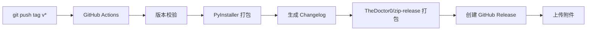

# [TASK010] - GitHub Release 自动发布 EXE

**Status:** Completed
**Added:** 2026-02-02
**Updated:** 2026-02-10

## Original Request

当前应用不需要发布 PyPI 包，而是要在发布新版本号时同步发布打包成 EXE 上传到 GitHub Release。

## 背景分析

PeekAPI 是一个本地桌面应用，用户通过下载 EXE 文件使用，不需要通过 pip 安装。因此发布流程需要：
1. 推送版本标签 (v*) 触发 CI
2. 在 Windows 环境下使用 PyInstaller 打包成 EXE
3. 将 EXE 及相关文件打包为 ZIP
4. 自动创建 GitHub Release 并上传 ZIP 文件

## 方案设计

### 方案概述



### 发布流程

1. **本地操作**
   ```bash
   just bump          # 选择版本类型，自动更新版本号
   git push && git push --tags
   ```

2. **CI 自动执行**（release.yml）
   - 校验 tag 版本与 pyproject.toml 版本一致
   - 使用 PyInstaller 打包 EXE
   - 使用 git-cliff 生成 changelog
   - 使用 **TheDoctor0/zip-release** 打包为 `PeekAPI-v{version}-windows.zip`
   - 创建 GitHub Release 并上传 ZIP

---

## TheDoctor0/zip-release 调研

### 基本信息

- **仓库**: https://github.com/TheDoctor0/zip-release
- **最新版本**: 0.7.6 (2023-10-31)
- **特性**: 跨平台（Linux, macOS, Windows），支持 zip/tar/7z 格式
- **Windows 特性**: 在 Windows 上自动使用 7zip 进行压缩

### 参数说明

| 参数                   | 默认值        | 说明                                      |
| ---------------------- | ------------- | ----------------------------------------- |
| `filename`             | `release.zip` | 输出文件名，相对于 `directory`            |
| `directory`            | `.`           | 工作目录（zip 命令执行的位置）            |
| `path`                 | `.`           | 要压缩的文件/目录路径，相对于 `directory` |
| `type`                 | `zip`         | 压缩格式：`zip` / `tar` / `7z`            |
| `exclusions`           | 无            | 排除的文件/目录列表（空格分隔）           |
| `recursive_exclusions` | 无            | 递归排除（仅 Windows 7zip 支持）          |
| `custom`               | 无            | 自定义压缩命令参数                        |
| `command`              | 无            | 压缩前执行的额外命令                      |

### 使用示例

```yaml
- name: Create ZIP archive
  uses: thedoctor0/zip-release@0.7.6
  with:
    type: 'zip'
    filename: 'PeekAPI-v${{ steps.version.outputs.VERSION }}-windows.zip'
    directory: 'dist'
    path: 'peekapi'
```

**说明**：
- `directory: 'dist'` - 在 dist 目录下执行
- `path: 'peekapi'` - 压缩 peekapi 文件夹
- 产出：`dist/PeekAPI-v{version}-windows.zip`

### 与其他方案对比

| 方案                          | 优点                                   | 缺点                 |
| ----------------------------- | -------------------------------------- | -------------------- |
| **TheDoctor0/zip-release** ✅  | 跨平台、声明式、活跃维护、支持多种格式 | 需要额外 Action      |
| PowerShell `Compress-Archive` | 原生支持                               | 仅 Windows、语法繁琐 |
| `vimtor/action-zip`           | 简洁                                   | 功能较少、更新不活跃 |

---

## 完整 release.yml 配置

```yaml
name: Release

on:
  push:
    tags:
      - v*

jobs:
  build:
    name: Build & Release
    runs-on: windows-latest
    permissions:
      contents: write
    steps:
      - name: Checkout
        uses: actions/checkout@v4
        with:
          fetch-depth: 0

      - name: Install uv
        uses: astral-sh/setup-uv@v5
        with:
          enable-cache: true

      - name: Set up Python
        run: uv python install 3.11

      - name: Install dependencies
        run: uv sync --group dev

      - name: Get version from tag
        id: version
        shell: pwsh
        run: |
          $version = "${{ github.ref_name }}".TrimStart('v')
          echo "VERSION=$version" >> $env:GITHUB_OUTPUT

      - name: Verify version match
        shell: pwsh
        run: |
          $content = Get-Content "pyproject.toml" -Raw
          if ($content -match 'version\s*=\s*"([^"]+)"') {
            $pyprojectVersion = $matches[1]
          }
          $tagVersion = "${{ steps.version.outputs.VERSION }}"
          if ($pyprojectVersion -ne $tagVersion) {
            Write-Error "Version mismatch: pyproject.toml=$pyprojectVersion, tag=$tagVersion"
            exit 1
          }
          Write-Host "Version verified: $tagVersion"

      - name: Build with PyInstaller
        run: uv run pyinstaller peekapi.spec --noconfirm

      - name: Create ZIP archive
        uses: thedoctor0/zip-release@0.7.6
        with:
          type: 'zip'
          filename: 'PeekAPI-v${{ steps.version.outputs.VERSION }}-windows.zip'
          directory: 'dist'
          path: 'peekapi'

      - name: Generate Changelog
        uses: orhun/git-cliff-action@v4
        id: changelog
        with:
          config: cliff.toml
          args: --latest --strip header
        env:
          GITHUB_REPO: ${{ github.repository }}

      - name: Create GitHub Release
        uses: softprops/action-gh-release@v2
        with:
          name: PeekAPI v${{ steps.version.outputs.VERSION }}
          body: ${{ steps.changelog.outputs.content }}
          files: dist/PeekAPI-v${{ steps.version.outputs.VERSION }}-windows.zip
        env:
          GITHUB_TOKEN: ${{ secrets.GITHUB_TOKEN }}
```

---

## 可选：添加 SHA256 校验和

```yaml
      - name: Generate checksum
        shell: pwsh
        working-directory: dist
        run: |
          $zipFile = "PeekAPI-v${{ steps.version.outputs.VERSION }}-windows.zip"
          $hash = (Get-FileHash $zipFile -Algorithm SHA256).Hash.ToLower()
          "$hash  $zipFile" | Out-File -Encoding utf8 "SHA256SUMS.txt"

      - name: Create GitHub Release
        uses: softprops/action-gh-release@v2
        with:
          name: PeekAPI v${{ steps.version.outputs.VERSION }}
          body: ${{ steps.changelog.outputs.content }}
          files: |
            dist/PeekAPI-v${{ steps.version.outputs.VERSION }}-windows.zip
            dist/SHA256SUMS.txt
        env:
          GITHUB_TOKEN: ${{ secrets.GITHUB_TOKEN }}
```

---

## 产出物命名规范

| 文件                             | 说明                                |
| -------------------------------- | ----------------------------------- |
| `PeekAPI-v{version}-windows.zip` | 主程序包（包含 peekapi.exe 及依赖） |
| `SHA256SUMS.txt`                 | 校验和文件（可选）                  |

---

## Implementation Plan

- [x] 1.1 创建基础 release.yml 工作流文件（含版本校验逻辑）
- [x] 1.2 集成 TheDoctor0/zip-release 打包
- [x] 1.3 配置 Release 产出物名称
- [-] 1.4 可选：添加 SHA256 校验和 (已跳过)
- [x] 1.5 测试完整发布流程

## Progress Tracking

**Overall Status:** Completed - 100%

### Subtasks
| ID  | Description                 | Status      | Updated    | Notes                      |
| --- | --------------------------- | ----------- | ---------- | -------------------------- |
| 1.1 | 创建基础 release.yml        | Complete    | 2026-02-02 | 含版本校验逻辑             |
| 1.2 | 集成 TheDoctor0/zip-release | Not Started | -          | v0.7.6，跨平台支持         |
| 1.3 | 配置 Release 产出物名称     | Not Started | -          | PeekAPI-v{ver}-windows.zip |
| 1.4 | 添加 SHA256 校验和          | Not Started | -          | 可选功能                   |
| 1.5 | 测试完整发布流程            | Not Started | -          | 需要推送测试 tag           |

## Progress Log

### 2026-02-02
- 创建任务文档
- 已有初始版本的 release.yml
- 调研 TheDoctor0/zip-release Action
  - 最新版本: 0.7.6
  - 支持 zip/tar/7z 格式
  - Windows 上自动使用 7zip
  - 参数: filename, directory, path, type, exclusions 等
- 设计完整的发布方案，采用 TheDoctor0/zip-release 作为压缩方案

### 2026-02-10
- 完成 release.yml 配置，修复版本检查逻辑
- 标记任务完成

